# 國立陽明交通大學 多模態影像資料處理 (MMIP) 作業三技術報告
## 卷積神經網路（CNN）影像分類、遷移學習與可解釋性

- **學生**：林孟霆（`315833033`）
- **規範依據**：課程投影片 `多模態影像資料處理（MMIP）第三堂_卷積神經網路（CNN）` 第 79–81 頁
- **配分**：Quiz 1（15 分）、Quiz 2（基礎 30 + 進階 20）、Quiz 3（基礎 15 + 進階 20），共 100 分
- **執行環境**：Google Colab，**Tesla T4 GPU**（CUDA），PyTorch 2.11.0；所有實驗皆在同一環境執行

> [!NOTE]
> **給助教的導覽 (For TA & Reviewers)**：
> - **文字報告與分析**：本 `README.md`（規範對齊、實驗設計、結果數據與分析），可直接在 GitHub 上閱讀。
> - **程式執行結果**：`HW03_notebook.ipynb` 已在 Colab Tesla T4 上執行完成，所有圖表與表格都內嵌在輸出中，可直接在 GitHub 上點閱，不需重新執行。
> - **圖表與逐張預測結果**：`Output/`（PNG 圖表、CSV 表格）；**每個 epoch 的訓練紀錄**：`Checkpoints/*.json`。
> - **AI 協作紀錄**：`AI/AI_collaboration_log.md`，包含提交前檢查所發現並修正的問題。
> - 所有數字皆來自實際訓練結果，README 與 Notebook 使用同一批模型，數字一致。Testing Dataset 只用於最終評估，每個模型保留的權重是依 **Validation** Accuracy 挑選的。
> - 模型權重（`Checkpoints/*.pt`，ResNet-18 每個約 45 MB）與 CIFAR-10 資料檔沒有放進 git；若要重新執行，程式會自動下載資料並重新訓練（Colab T4 約 1–1.5 小時，CPU 需數小時）。

### 評分項目對照表（各小題在哪裡看）

| 題目（配分） | 規範要求 | 文字說明與分析 | Notebook 段落 | 圖表 / 結果檔 |
| :--- | :--- | :--- | :--- | :--- |
| Quiz 1-1（5） | 資料來源與內容 | [Quiz 1 §1](#1-資料來源與內容5-分) | Quiz 1 | `Output/quiz1_dataset_overview.png` |
| Quiz 1-2（5） | 資料切分 | [Quiz 1 §2](#2-資料切分5-分) | Quiz 1 | 同上（右側類別分佈） |
| Quiz 1-3（5） | 問題定義 | [Quiz 1 §3](#3-問題定義5-分) | Quiz 1 | — |
| Quiz 2 基礎（9 + 9） | Plain CNN、經典 Backbone 訓練與 Top-1 / Top-5 | [Quiz 2 §1–2](#1-模型設計) | Quiz 2 基礎：訓練曲線與 Top-1 / Top-5 | `Output/quiz2_baseline_training_curves.png`、`quiz2_model_comparison.csv` |
| Quiz 2 基礎（3 + 3） | 兩個模型預測 Testing Dataset 並整理結果 | [Quiz 2 §3](#3-基礎testing-dataset-預測結果整理) | Quiz 2 基礎：Testing Dataset 預測結果整理 | `Output/quiz2_plain_cnn_test_predictions.csv`、`quiz2_resnet18_test_predictions.csv`、`quiz2_confusion_matrices.png`、`quiz2_sample_predictions.png` |
| Quiz 2 基礎（6） | 各類別 ROC、Macro-AUC、Accuracy 與參數量比較 | [Quiz 2 §4](#4-基礎各類別-roc-curve-與-macro-auc) | Quiz 2 基礎：各類別 ROC Curve | `Output/quiz2_roc_curves.png` |
| Quiz 2 進階（10） | Plain CNN 超參數實驗與實驗設計 | [Quiz 2 §5](#5-進階plain-cnn-超參數實驗10-分) | Quiz 2 進階 | `Output/quiz2_plain_hparam_curves.png`、`quiz2_plain_hparam_results.csv` |
| Quiz 2 進階（10） | 經典 Backbone 超參數實驗（遷移學習） | [Quiz 2 §6](#6-進階resnet-18-遷移學習實驗10-分) | Quiz 2 進階 | `Output/quiz2_resnet_hparam_curves.png`、`quiz2_resnet_hparam_results.csv` |
| Quiz 3 基礎（8 + 7） | 兩個模型加入 Data Augmentation 前後比較與策略說明 | [Quiz 3 §1](#1-基礎資料擴增plain-cnn-8-分resnet-18-7-分) | Quiz 3 基礎 | `Output/quiz3_plain_augmentation_curves.png`、`quiz3_resnet_augmentation_curves.png`、`quiz3_augmentation_results.csv` |
| Quiz 3 進階（10） | 視覺化兩個 Kernel 並分析用途 | [Quiz 3 §2](#2-進階kernel-視覺化10-分) | Quiz 3 進階：Kernel 視覺化 | `Output/quiz3_kernel_visualization.png` |
| Quiz 3 進階（10） | XAI 解釋模型關注的影像區域 | [Quiz 3 §3](#3-進階xai--grad-cam10-分) | Quiz 3 進階：Grad-CAM | `Output/quiz3_gradcam.png`、`quiz3_gradcam_records.csv` |

---

## 目錄結構

```text
HW03/
├── HW03_main.py              # 一鍵執行 Quiz 1–3（已訓練的模型會從 Checkpoints/ 直接讀取）
├── HW03_notebook.ipynb       # 已在 Colab T4 執行完成、內嵌所有圖表的 Notebook
├── README.md                 # 本報告
├── requirements.txt
├── Code/
│   ├── data.py               # CIFAR-10 下載、分層切分、正規化、批次資料擴增
│   ├── models.py             # Plain CNN、ResNet-18（遷移學習）
│   ├── train.py              # 訓練迴圈（自動使用 GPU）、Top-k、checkpoint 快取
│   ├── experiments.py        # 全部 10 組實驗設定（集中定義）
│   ├── evaluation.py         # 測試集評估、混淆矩陣、各類別 ROC / Macro-AUC、訓練曲線
│   ├── xai.py                # Kernel 視覺化、Grad-CAM
│   └── quiz1_dataset.py / quiz2_cnn.py / quiz3_generalization.py
├── Data/README.md            # 資料來源說明（資料集檔案由程式自動下載，不放進 git）
├── Checkpoints/              # 10 組實驗的訓練紀錄 (*.json)；模型權重 (*.pt) 不放進 git
├── Output/                   # 所有圖表與 CSV 結果
└── AI/AI_collaboration_log.md
```

**執行方式**：`pip install -r requirements.txt` 後執行 `python HW03_main.py`，或開啟 `HW03_notebook.ipynb`。本作業在 Colab 的做法是將 `HW03/` 壓縮成 `HW03.zip` 上傳，Notebook 第一格會自動解壓縮並切換到該目錄（也支援放在 Google Drive 的 `MyDrive/MMIP/HW03`），執行階段選 T4 GPU。

---

## Quiz 1：準備資料集（15 分）

### 1. 資料來源與內容（5 分）
- **CIFAR-10**（Krizhevsky, 2009），<https://www.cs.toronto.edu/~kriz/cifar.html>。多倫多大學伺服器下載速度過慢（低於 1 KB/s），因此改由原作者群 `uoft-cs` 在 Hugging Face 上傳的官方版本下載：<https://huggingface.co/datasets/uoft-cs/cifar10>，影像與標籤與官方版本相同。
- 60,000 張 32×32 RGB 彩色影像，10 個互斥類別，每類 6,000 張：airplane、automobile、bird、cat、deer、dog、frog、horse、ship、truck。

### 2. 資料切分（5 分）
| 資料集 | 張數 | 每類張數 | 來源 |
| :--- | :---: | :---: | :--- |
| Training | 45,000 | 4,500 | 官方訓練集，分層抽樣（stratified，seed = 42） |
| Validation | 5,000 | 500 | 官方訓練集，分層抽樣 |
| Testing | 10,000 | 1,000 | 官方測試集 |

- 採用**分層 Hold-out 切分**，三個子集的類別比例完全相同。
- 沒有採用 K-Fold：K-Fold 要把每組實驗重訓 K 次，本作業共有 10 組實驗，成本會變成 K 倍；而 CIFAR-10 的 Validation 每類有 500 張，已足以穩定比較不同模型。
- Validation 只用來挑選最佳 epoch 的權重；Testing 只在最後評估一次。

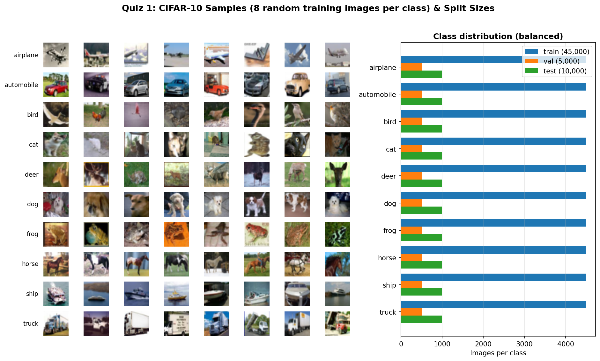

### 3. 問題定義（5 分）
- **任務**：單標籤、10 類別的影像分類（Multi-class Classification），每張影像恰好屬於一個類別。
- **輸入 X**：3×32×32 的 RGB 影像，以 ImageNet 的平均值與標準差正規化。
- **輸出 Y**：10 個類別的機率分佈（Softmax），取機率最高者為 Top-1 預測。
- **損失函數**：Cross-Entropy。**評估指標**：Top-1 / Top-5 Accuracy、各類別 ROC 與 Macro-AUC。
- **難點**：解析度只有 32×32，且部分類別外觀相近（cat/dog、automobile/truck），這些也是本作業實際觀察到的主要錯誤來源（見 Quiz 2 混淆矩陣）。

---

## Quiz 2：訓練 CNN 影像分類模型（基礎 30 分 + 進階 20 分）

### 1. 模型設計
**Plain CNN（自行設計）**：VGG 式架構，沒有任何 shortcut（residual）連接。

| 區塊 | 結構 | 輸出大小 |
| :--- | :--- | :---: |
| Block 1 | [Conv3×3(32) → BN → ReLU] ×2 → MaxPool | 32×16×16 |
| Block 2 | [Conv3×3(64) → BN → ReLU] ×2 → MaxPool | 64×8×8 |
| Block 3 | [Conv3×3(128) → BN → ReLU] ×2 | 128×8×8 |
| Head | Global Average Pooling → Dropout(0.3) → Linear(10) | 10 |

**經典 CNN Backbone：ResNet-18**（He et al., 2015）。載入 ImageNet 預訓練權重，將最後的 fc 層換成 10 類別輸出。ResNet-18 會把輸入縮小 32 倍，32×32 的影像到最後只剩 1×1 的特徵圖，因此先將影像雙線性放大到 64×64 再輸入。

**共同設定**：Adam、Batch Size 128、Cross-Entropy。每個 epoch 結束以 Validation 評估，保留 Validation Accuracy 最高的權重。

| 超參數 | Plain CNN | ResNet-18 |
| :--- | :---: | :---: |
| Learning Rate | 1e-3 | 1e-4（微調預訓練權重，使用較小學習率） |
| Epochs | 30 | 15 |
| Dropout | 0.3 | —（ResNet-18 原架構無 Dropout） |

### 2. 基礎：Top-1 / Top-5 Accuracy、參數量與 Macro-AUC（Testing Dataset，10,000 張）

| 模型 | 參數量 | 最佳 epoch | Val Acc | **Test Top-1** | **Test Top-5** | **Macro-AUC** | 訓練時間 (T4) |
| :--- | ---: | :---: | :---: | :---: | :---: | :---: | :---: |
| Plain CNN | 288,746 | 23 / 30 | 0.8320 | **0.8344** | **0.9917** | **0.9839** | 2.9 分鐘 |
| ResNet-18（預訓練 + 微調） | 11,181,642 | 15 / 15 | 0.8948 | **0.8980** | **0.9961** | **0.9916** | 4.2 分鐘 |

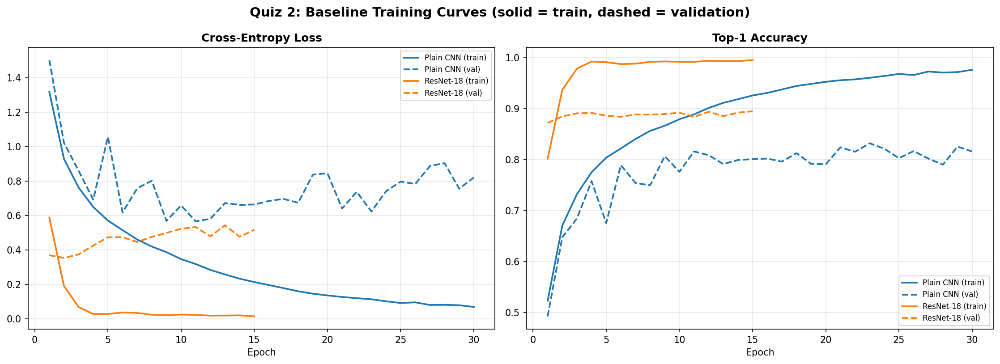

**曲線判讀**：實線（Train）平滑下降，虛線（Validation）上下跳動，這是預期中的現象，不是訓練失敗：
- Train 曲線是整個 epoch 約 350 個 mini-batch 的平均，所以很平滑；Validation 曲線是每個 epoch 結束時的單次評估，而且全程使用固定學習率（沒有學習率排程），權重每個 epoch 仍在明顯變動，所以數值會跳動。
- **Validation Loss 回升、Validation Accuracy 卻持平**：代表模型對「答錯的樣本」越來越有信心，Cross-Entropy 會對這些高信心的錯誤給很大的懲罰，所以 Loss 上升但答對的比例沒變。這是過擬合的典型徵兆，也是 Quiz 3 資料擴增要處理的問題（加入擴增後 Validation 曲線明顯變平穩、Loss 持續下降）。
- 訓練正常的證據：Train Loss 持續下降到接近 0；Test Top-1 與 Validation Accuracy 幾乎相同（Plain 0.8344 vs 0.8320、ResNet-18 0.8980 vs 0.8948），代表以 Validation 挑出的權重在沒看過的測試集上表現一致。

### 3. 基礎：Testing Dataset 預測結果整理
- 每張測試影像的預測（真實類別、預測類別、信心值、是否正確、Top-5 類別）存於 `Output/quiz2_plain_cnn_test_predictions.csv` 與 `Output/quiz2_resnet18_test_predictions.csv`。
- **最主要的錯誤**：Plain CNN 把 **cat 誤判成 dog 171 張**、dog 誤判成 cat 93 張、automobile 誤判成 truck 70 張；ResNet-18 最大的錯誤是 **dog 誤判成 cat 105 張**、cat 誤判成 dog 98 張。兩個模型答對最少的類別都是 cat（Plain 662 / 1000、ResNet 810 / 1000）。

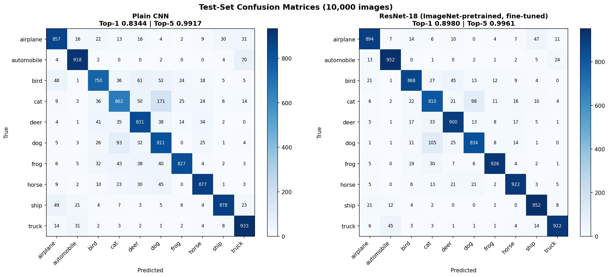
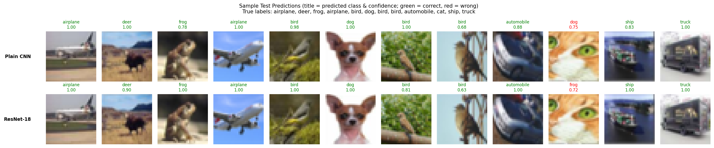

### 4. 基礎：各類別 ROC Curve 與 Macro-AUC

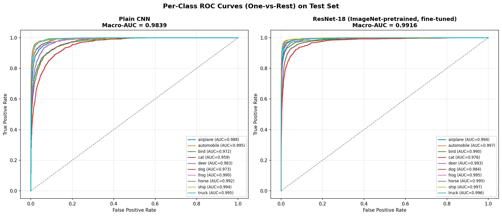

| 類別 AUC | airplane | automobile | bird | **cat** | deer | dog | frog | horse | ship | truck |
| :--- | :---: | :---: | :---: | :---: | :---: | :---: | :---: | :---: | :---: | :---: |
| Plain CNN | 0.988 | 0.995 | 0.972 | **0.959** | 0.983 | 0.973 | 0.990 | 0.992 | 0.994 | 0.995 |
| ResNet-18 | 0.994 | 0.997 | 0.990 | **0.976** | 0.993 | 0.984 | 0.995 | 0.995 | 0.997 | 0.996 |

**Accuracy 與參數量比較**
1. **參數量約多 38.7 倍，Top-1 提升 6.4 個百分點**（0.8344 → 0.8980），Macro-AUC 由 0.9839 提升到 0.9916，且 ResNet-18 在 10 個類別的 AUC 都比 Plain CNN 高。不過 ResNet 的優勢不只來自參數量，也來自 ImageNet 預訓練權重：同樣架構從頭訓練只有 0.7843（見進階實驗）。
2. **參數效率**：Plain CNN 只用 2.6% 的參數，就達到 ResNet-18 約 93% 的 Top-1 Accuracy，在資源受限的情境下是很有效率的選擇。
3. **Top-5 兩者都超過 99%**：CIFAR-10 只有 10 類，Top-5 等於猜中一半的類別，因此 Top-5 幾乎沒有區分能力，比較模型應以 Top-1 與 Macro-AUC 為主。
4. **最難的類別**：兩個模型 AUC 最低的都是 **cat**，與混淆矩陣中 cat↔dog 是最大錯誤一致；貓狗在 32×32 解析度下外型非常相近。

### 5. 進階：Plain CNN 超參數實驗（10 分）

**實驗設計**：一次只改一個因素，其餘設定與基準完全相同，才能把差異歸因到該因素。

| 實驗 | 改變 | 最佳 epoch | Final Train Acc | Val Acc | **Test Top-1** | Macro-AUC |
| :--- | :--- | :---: | :---: | :---: | :---: | :---: |
| `plain_baseline` | —（lr 1e-3、Dropout 0.3） | 23 | 0.9763 | 0.8320 | **0.8344** | 0.9839 |
| `plain_lr1e-2` | 學習率 ×10 | 25 | 0.9749 | 0.8242 | 0.8329 | 0.9831 |
| `plain_lr1e-4` | 學習率 ÷10 | 30 | 0.9068 | 0.7772 | 0.7748 | 0.9731 |
| `plain_dropout0` | 移除 Dropout | 30 | 0.9847 | 0.8144 | 0.8170 | 0.9816 |

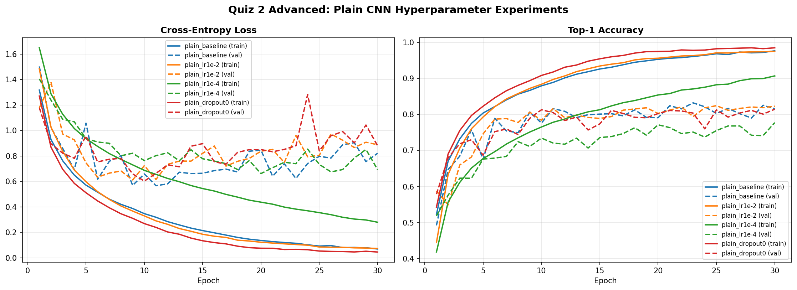

**觀察**
- **學習率 1e-4 太小**：30 個 epoch 後 Train Acc 只有 0.907，Validation 仍在上升（最佳 epoch = 30），代表在固定 epoch 預算內**收斂不足**，Test Top-1 比基準低 6 個百分點。
- **學習率 1e-2**：Test Top-1（0.8329）與基準（0.8344）幾乎相同。搭配 BatchNorm 與 Adam 後，這個架構對較大的學習率相當穩定，沒有出現發散。
- **移除 Dropout**：Train Acc 最高（0.9847），但 Test Top-1 下降 1.7 個百分點，Validation Loss 震盪也更大（第 24 個 epoch 跳到約 1.28），代表**過擬合更嚴重**，Dropout 確實有正則化效果。
- **過擬合現象**：基準、lr 1e-2 與無 Dropout 這三組的 Validation Loss 大約從第 10 個 epoch 開始回升，Train/Val Accuracy 的差距持續擴大；這正是 Quiz 3 資料擴增要處理的問題。

### 6. 進階：ResNet-18 遷移學習實驗（10 分）

**實驗設計**：三組對照，每組只差一個因素。
- 基準 vs `finetune_lr1e-3`：**微調學習率**的影響
- `finetune_lr1e-3` vs `frozen_lr1e-3`：**全部微調 vs 凍結 Backbone（Feature Extraction）**
- `finetune_lr1e-3` vs `scratch_lr1e-3`：**有無 ImageNet 預訓練**（遷移學習的效益）

| 實驗 | 可訓練參數 | 最佳 epoch | Final Train Acc | Val Acc | **Test Top-1** | Macro-AUC | 時間 |
| :--- | ---: | :---: | :---: | :---: | :---: | :---: | :---: |
| `resnet18_finetune_lr1e-4`（基準） | 11,181,642 | 15 | 0.9955 | 0.8948 | **0.8980** | 0.9916 | 4.2 分 |
| `resnet18_finetune_lr1e-3` | 11,181,642 | 14 | 0.9844 | 0.8608 | 0.8579 | 0.9884 | 4.2 分 |
| `resnet18_frozen_lr1e-3` | 5,130 | 14 | 0.7865 | 0.7572 | 0.7666 | 0.9716 | 1.3 分 |
| `resnet18_scratch_lr1e-3` | 11,181,642 | 10 | 0.9826 | 0.7852 | 0.7843 | 0.9747 | 4.2 分 |

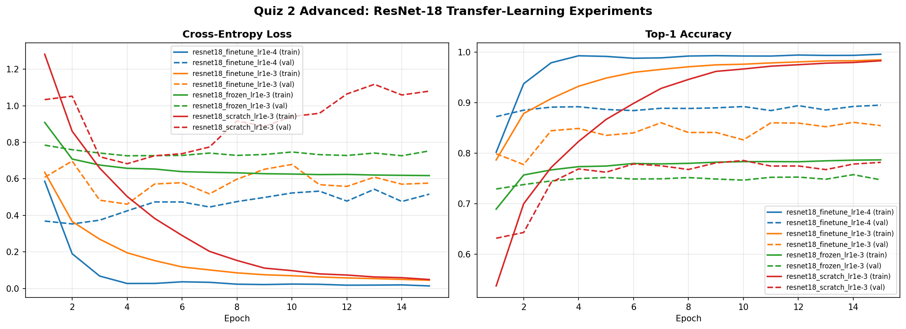

**觀察**
- **預訓練的效益最大**：同樣使用 lr 1e-3，載入 ImageNet 權重的微調（0.8579）比從頭訓練（0.7843）高 **7.4 個百分點**。從頭訓練在第 10 個 epoch 就達到最佳，之後 Train Acc 持續上升到 0.98、Validation 卻不再進步，代表 1,100 萬個參數在 45,000 張影像上明顯過擬合。
- **微調學習率要小**：lr 1e-3 比 lr 1e-4 低 4 個百分點。學習率太大會在一開始就大幅改動預訓練權重、破壞已經學好的特徵，這也是遷移學習通常用較小學習率微調的原因。
- **只訓練最後一層**（凍結 Backbone）只有 5,130 個可訓練參數、訓練最快（1.3 分鐘），但準確率只有 0.7666：ImageNet 的特徵直接套用到放大後的 32×32 影像並不完全適用，需要微調整個網路讓特徵適應新的資料分佈。
- **結論**：本資料集的最佳策略是「ImageNet 預訓練 + 以小學習率全部微調」。

---

## Quiz 3：提升泛化能力（基礎 15 分 + 進階 20 分）

### 1. 基礎：資料擴增（Plain CNN 8 分、ResNet-18 7 分）

**擴增策略**（只在訓練時套用，驗證與測試不做擴增；兩個模型使用相同策略，其餘設定與各自的基準完全相同）：
1. **Random Crop**：四周以 reflect padding 補 4 像素後，隨機裁回 32×32（最多平移 ±4 像素），讓模型不依賴物體在畫面中的固定位置。
2. **Random Horizontal Flip**（p = 0.5）：左右翻轉不會改變 CIFAR-10 的類別。刻意**不做垂直翻轉**，因為倒過來的車子或動物不會出現在測試資料中，反而會引入不存在的分佈。
3. **亮度 / 對比擾動**：每張影像各自乘上 [0.8, 1.2] 之間的隨機亮度與對比係數，模擬不同光照（對應簡報 AlexNet 顏色擾動的概念）。

| 實驗 | 最佳 epoch | Final Train Acc | Val Acc | Train−Val 差距 | **Test Top-1** | Test Top-5 | Macro-AUC |
| :--- | :---: | :---: | :---: | :---: | :---: | :---: | :---: |
| Plain CNN（無擴增） | 23 | 0.9763 | 0.8320 | 0.1605 | 0.8344 | 0.9917 | 0.9839 |
| **Plain CNN + 擴增** | 30 | 0.8920 | 0.8672 | **0.0248** | **0.8661**（+3.2） | 0.9951 | 0.9902 |
| ResNet-18（無擴增） | 15 | 0.9955 | 0.8948 | 0.1007 | 0.8980 | 0.9961 | 0.9916 |
| **ResNet-18 + 擴增** | 13 | 0.9736 | 0.9202 | **0.0572** | **0.9138**（+1.6） | 0.9976 | 0.9953 |

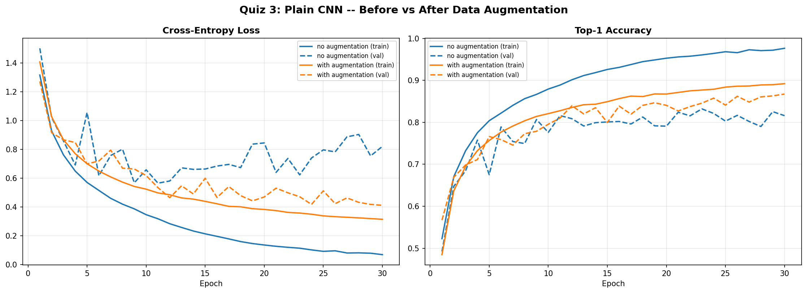
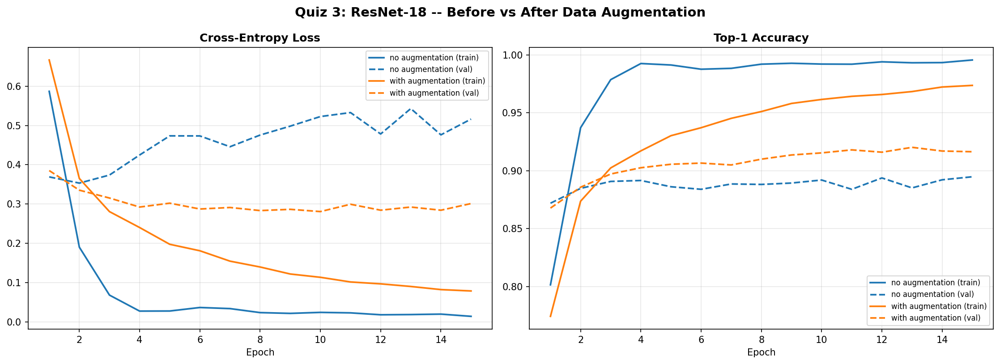

**觀察**
- **兩個模型的 Test Top-1、Top-5、Macro-AUC 都提升**：Plain CNN +3.2 個百分點、ResNet-18 +1.6 個百分點。
- **過擬合明顯改善**：Plain CNN 的 Train−Val 差距由 0.16 縮小到 0.02；沒有擴增時 Validation Loss 大約從第 10 個 epoch 開始回升，加入擴增後則持續下降。擴增讓訓練資料更難被「背下來」，所以 Train Acc 反而下降（0.976 → 0.892），但泛化能力變好。
- **Plain CNN 的提升比 ResNet-18 大**：Plain CNN 沒有預訓練，完全依賴這 45,000 張影像學習，因此更需要擴增來增加資料多樣性；ResNet-18 已從 ImageNet 學到較通用的特徵，擴增帶來的邊際效益較小。
- **Plain CNN + 擴增在第 30 個 epoch 仍在進步**（最佳 epoch = 30）：加入擴增後需要更多 epoch 才能收斂，增加訓練輪數應還有提升空間。

### 2. 進階：Kernel 視覺化（10 分）

使用**微調後 ResNet-18 的第一層卷積**（64 個 7×7×3 kernel）。為了避免人工挑選好看的圖，依照明確的規則自動選出兩個 kernel：
- **Kernel A（邊緣規則）**：在三個通道權重幾乎相同（colour ratio < 0.3，只看明暗）的 kernel 中，選出在 1,000 張 Validation 影像上**特徵圖反應起伏最大**的一個（特徵圖空間標準差的平均值，排除最外圈 3 像素的邊界效應）→ 選到 **#26**（colour ratio = 0.21，平均反應起伏 4.49，64 個 kernel 的中位數為 0.97）。
  - 不直接用「權重能量最大」來挑的原因：那樣會選到 #24，它是極高頻的條紋濾波器，在 CIFAR-10 影像上的平均反應起伏只有 0.16，特徵圖幾乎看不出影像內容，無法用來分析用途。
- **Kernel B（色彩規則）**：R/G/B 三通道權重差異最大 → 選到 **#23**（colour ratio = 0.999）。

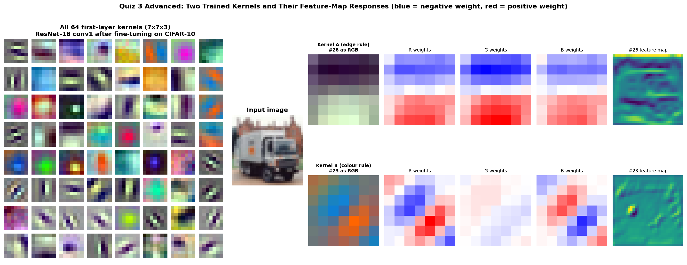

**分析**（輸入影像為 ResNet-18 最有信心答對的一張測試影像：卡車）
- **Kernel #26：灰階的水平邊緣偵測器**。三個通道的權重形狀幾乎一樣，所以它只看明暗、不看顏色；上半部為負、下半部為正，等於計算「下方亮度 − 上方亮度」的垂直方向梯度。遇到「上暗下亮」的水平邊界時反應為正（亮），遇到「上亮下暗」的邊界時反應為負（暗），亮度均勻的區域接近 0。特徵圖中最明顯的是沿著卡車車身、車窗與車底分佈的**水平亮帶與暗帶**，垂直方向的輪廓則幾乎沒有反應，與權重的方向一致。最上緣一排特別亮，是影像邊界 zero padding 造成的明暗落差，不是卡車本身的內容。
- **Kernel #23：紅/橘 vs 藍的色彩對立（color-opponent）邊緣偵測器**。R 通道右下為正、左上為負，B 通道剛好相反，G 通道接近 0，因此它在「一側偏紅橘、另一側偏藍」的斜向邊界上反應最強。特徵圖中最亮的點正好落在**卡車車身上的橘色標誌**，其餘反應沿著車體的斜向邊緣分佈，與權重分析一致。
- **整體**：64 個 kernel 中可以看到不同方向的邊緣、條紋，以及各種顏色的色塊與色彩對立組合，與簡報中 AlexNet 第一層「不同方向的 Edge、不同的顏色組合」的觀察相同。第一層學到的是最基本的邊緣與顏色特徵，更深的層再把它們組合成物體的部件。

### 3. 進階：XAI — Grad-CAM（10 分）

**方法**：Grad-CAM（Selvaraju et al., 2017）。先 Forward 取得特徵圖 A，再對預測類別的分數做 Backward 取得梯度；將每個通道的梯度做空間平均作為權重 α，計算 ReLU(Σ α·A)，放大後疊回原圖。紅色代表最能提高該類別分數的區域。
- Plain CNN 使用 `block3`（8×8 特徵圖）；ResNet-18 使用 `layer3`（64×64 輸入下為 4×4）。`layer4` 只剩 2×2，空間解析度太低，看不出關注區域。
- **樣本依規則選取**：前 6 個類別中「兩個模型都答對」的測試影像各一張，以及 4 張「兩個模型都答錯」的影像。

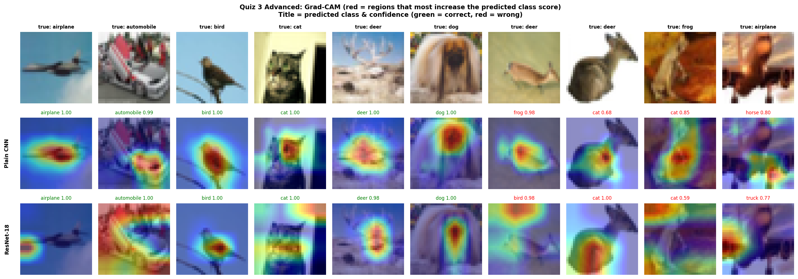

**量化**：`centre_mass` = Grad-CAM 熱圖落在影像中央 16×16 區域（佔 25% 面積）的比例；若熱圖均勻分佈，數值為 0.25。

| 模型 | 答對（6 張）平均 | 答錯（4 張）平均 |
| :--- | :---: | :---: |
| Plain CNN | 0.517 | 0.540 |
| ResNet-18 | 0.456 | **0.230** |

**分析**
- **答對的樣本大多聚焦在物體本身**：Plain CNN 的熱圖集中在飛機機身、鳥、貓臉、鹿的身體、狗臉；ResNet-18 對鳥、鹿、狗也聚焦在主體上，表示模型是依據物體外觀在判斷，而不是背景。
- **ResNet-18 有時看的是背景**：飛機那張的熱點落在左側天空、汽車那張分散在周圍、貓那張集中在右上角的背景。ResNet-18 的 Grad-CAM 只有 4×4，解析度較粗；而且這幾張它仍以高信心答對，推測它部分利用了「藍天 → 飛機」這類背景與類別的關聯。
- **ResNet-18 答錯時，注意力明顯離開物體**：答錯樣本的 centre_mass 只有 0.230（接近均勻分佈的 0.25），答對時則為 0.456。例如第 7 張鹿被判成 bird 時，熱點落在上方的草地背景；第 9 張青蛙被判成 cat 時，熱點在橘色背景上。
- **Plain CNN 答錯時仍看著物體，但被外觀誤導**：它的熱點大多還在主體上（centre_mass 0.540），錯誤來自外觀相似——趴著的鹿被判成 frog / cat、正面視角的飛機（起落架看起來像腿）被判成 horse。
- **限制**：每組只有 4–6 張影像，centre_mass 的差異只能視為觀察到的趨勢，不足以作為統計結論；而且物體不一定位在畫面中央。

---

## 限制與說明
1. **訓練預算**：所有實驗使用固定 epoch（Plain 30、ResNet 15），沒有使用學習率排程。部分實驗（Plain CNN + 擴增、Plain lr 1e-4）的最佳 epoch 就是最後一個 epoch，增加訓練輪數應還有提升空間。
2. **沒有使用 K-Fold**：原因見 Quiz 1。每組實驗只訓練一次（seed = 42），差距在 1 個百分點以內的比較（例如 lr 1e-2 vs 基準）不能視為顯著差異。
3. **ResNet-18 輸入放大到 64×64**：這是為了讓 ImageNet 預訓練特徵與 Grad-CAM 有足夠的空間解析度，代價是運算量比直接使用 32×32 大約多 4 倍。
